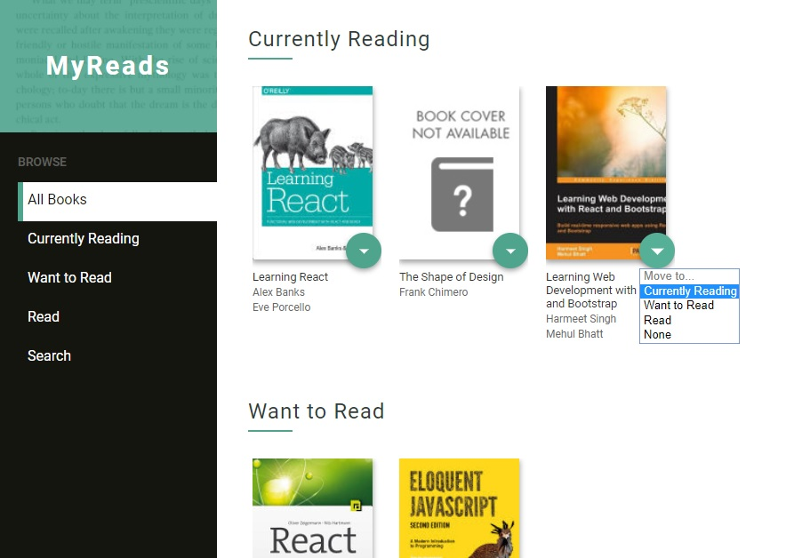
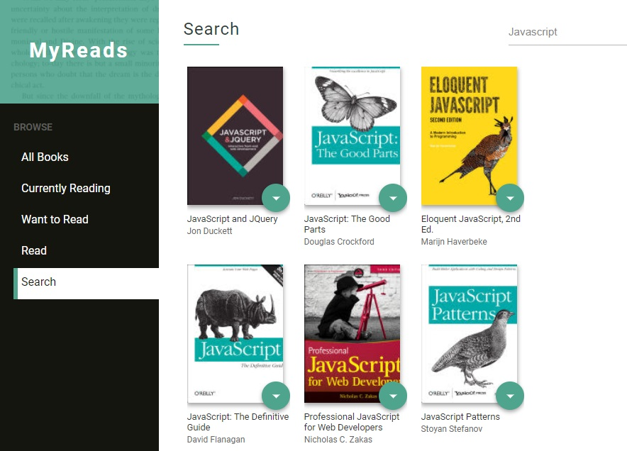

# MyReads - Udacity

This is a project for the Udacity Front-End Nanodegree called **MyReads**.

Check out this project on [GitHub Pages](https://al-yasa.github.io/MyReads-Udacity/ "MyReads - Belhenniche Al-Yasa'").

## Description


A book tracking application, allowing users to search for books online and to dynamically store them in different shelves: currently reading, want to read, and read.

The project emphasizes using React to build the application and provides an API server and client library that you will use to persist information as you interact with the application.





### Built With

- Javascript (Programming Language)

    - [React](https://reactjs.org/) (A JavaScript library for building UI)

        - React Router, react-dom, react-router-dom, react-scripts, prop-types

- [Cmder](https://cmder.net/) (console emulator for Windows)

    - [create-react-app](https://github.com/facebookincubator/create-react-app) (React project scaffolding manager)

    - [git](https://git-scm.com/downloads) (Version control system)

        - gh-pages

    - [npm](https://nodejs.org/en/download/) (Javascript package manager)

- [VSCode](https://code.visualstudio.com/) (Free. Open source code editor)

- HTML5/CSS3 (Markup/Styling languages)

### What You're Getting

```bash
├── CONTRIBUTING.md
├── README.md - This file.
├── SEARCH_TERMS.md # The whitelisted short collection of available search terms for you to use with your app.
├── package.json # npm package manager file. It's unlikely that you'll need to modify this.
├── public
│   ├── favicon.ico # App Icon, You may change if you wish.
│   └── index.html # DO NOT MODIFY
└── src
    ├── App.css # Styles for your app. Feel free to customize this as you desire.
    ├── App.js # This is the root of your app. Contains static HTML right now.
    ├── App.test.js # Used for testing. Provided with Create React App. Testing is encouraged, but not required.
    ├── BooksAPI.js # A JavaScript API for the provided Udacity backend. Instructions for the methods are below.
    ├── components # The building blocks of the app
    │   ├── Book.js # A functional component that display a book
    │   ├── BookShelf.js # A class component that holds a collection of books
    │   ├── Loader.js # A functional component that display a loader when neaded
    │   ├── Message.js #  A class component that display a dynamic message when neaded
    │   ├── Search.js # A class component that holds the search logic
    │   └── SideMenu.js # A functional component representing the menu holding links
    ├── icons # Helpful images for your app. Use at your discretion
    │   └── arrow-drop-down.svg
    ├── imgs # Helpful images for your app. Use at your discretion
    │   └── bookPage.jpg
    ├── index.css # Global styles. You probably won't need to change anything here.
    └── index.js # You should not need to modify this file. It is used for DOM rendering only.
```

Remember that good React design practice is to create new JS files for each component and use import/require statements to include them where they are needed.

### Backend Server

To simplify your development process, we've provided a backend server for you to develop against. The provided file [`BooksAPI.js`](src/BooksAPI.js) contains the methods you will need to perform necessary operations on the backend:

* [`getAll`](#getall)
* [`update`](#update)
* [`search`](#search)

#### `getAll`

Method Signature:

```js
getAll()
```

* Returns a Promise which resolves to a JSON object containing a collection of book objects.
* This collection represents the books currently in the bookshelves in your app.

#### `update`

Method Signature:

```js
update(book, shelf)
```

* book: `<Object>` containing at minimum an `id` attribute
* shelf: `<String>` contains one of ["wantToRead", "currentlyReading", "read"]
* Returns a Promise which resolves to a JSON object containing the response data of the POST request

#### `search`

Method Signature:

```js
search(query)
```

* query: `<String>`
* Returns a Promise which resolves to a JSON object containing a collection of a maximum of 20 book objects.
* These books do not know which shelf they are on. They are raw results only. You'll need to make sure that books have the correct state while on the search page.

## Usage

You can run the app locally or online.

If you want to run online you have to visit this project on [GitHub Pages](https://al-yasa.github.io/MyReads-Udacity/ "MyReads - Belhenniche Al-Yasa'").

If you want to run locally you have to download the app first:

### Method 1:

1. Click on the green `Clone or download` button above.

2. Click on `Download ZIP`.

3. Extract downloaded Zip file.

4. Install all project dependencies with `npm install`.

5. Run server with `npm start`.

6. With your server running, visit the site: `http://localhost:3000`.

### Method 2:

1. If you have git installed you can clone this repo to your desktop by running this command line:
`git clone https://github.com/Al-Yasa/MyReads-Udacity.git`

2. Install all project dependencies with `npm install`.

3. Run server with `npm start`.

4. With your server running, visit the site: `http://localhost:3000`.

## Important
The backend API uses a fixed set of cached search results and is limited to a particular set of search terms, which can be found in [SEARCH_TERMS.md](SEARCH_TERMS.md). That list of terms are the _only_ terms that will work with the backend, so don't be surprised if your searches for Basket Weaving or Bubble Wrap don't come back with any results.